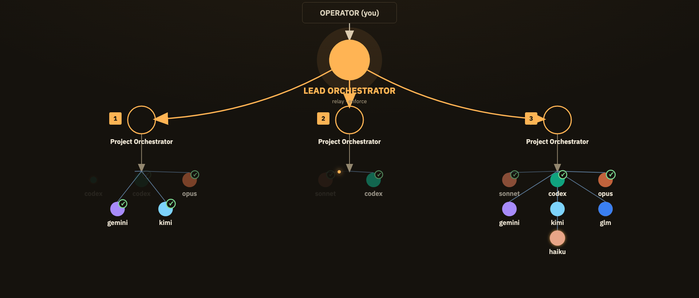
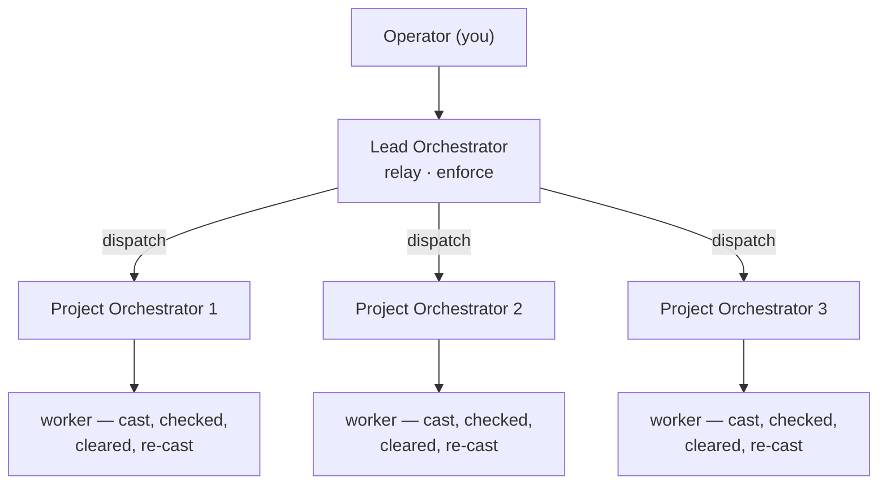
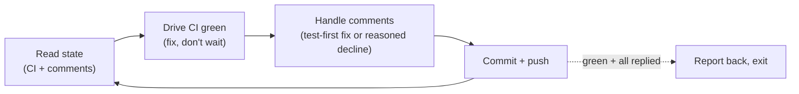

<p align="center">
  
</p>

# agent-skills

[](https://github.com/kellykampen/agent-skills/releases)
[](LICENSE)

A small, composable collection of [Claude Code](https://claude.com/claude-code) agent skills for real engineering work — orchestrating fleets of agents, reviewing code, shipping PRs, and building more skills.

Each skill is a self-contained folder with a `SKILL.md` (plus any supporting docs/scripts). They're designed to be **small, easy to adapt, and model-agnostic** — fork them, rename them, make them your own. Every skill's README has a short demo GIF (full video with audio linked alongside it) so you can see what it actually does before installing.

## Install

Install with the [`skills`](https://skills.sh) CLI:

```bash
npx skills@latest add kellykampen/agent-skills
```

Pick the skills you want and the agents to install them on. Or just browse the folders and copy what's useful.

**Just want one skill?** Each has its own README with a one-off install command, e.g.:

```bash
npx skills add kellykampen/agent-skills --skill cmux-pr-qc-agent
```

## Skills

### [`agents/`](./skills/agents/README.md) — running & delegating to other agents

| Skill | What it does |
| --- | --- |
| [cmux-agent-orchestrator](./skills/agents/README.md#cmux-agent-orchestrator) | Run a hierarchy of Claude Code orchestrators across cmux workspaces — a lead that drives per-project sub-orchestrators, relays decisions, runs digest/watch loops, and enforces evidence-based QC. |
| [cmux-pr-qc-agent](./skills/agents/README.md#cmux-pr-qc-agent) | Spin up an autonomous Claude Code instance in a separate cmux pane that watches a GitHub PR end-to-end — drives CI to green, fixes review comments test-first, and replies per thread until it's mergeable. |

### [`harness/`](./skills/harness/README.md) — driving a different AI coding harness

| Skill | What it does |
| --- | --- |
| [antigravity-cli](./skills/harness/README.md#antigravity-cli) | Drive Google's Antigravity CLI (`agy`) from the shell to delegate coding, review, or bulk work to a *different* (non-Claude) model harness. |

### [`engineering/`](./skills/engineering/README.md) — code & backend work

| Skill | What it does |
| --- | --- |
| [coderabbit-request](./skills/engineering/README.md#coderabbit-request) | Request a [CodeRabbit](https://coderabbit.ai) review of your uncommitted changes and return a structured, severity-categorized issue list. |
| [convex-domain-folder](./skills/engineering/README.md#convex-domain-folder) | Reorganize a [Convex](https://convex.dev) backend into per-domain folders (schema/queries/mutations/model per domain), handling the api-path and test-resolution changes that trip people up. |
| [add-to-changelog](./skills/engineering/README.md#add-to-changelog) | Add an entry to `CHANGELOG.md` (Keep a Changelog + SemVer). _User-invoked._ |
| [update-docs](./skills/engineering/README.md#update-docs) | Update README/docs/CLAUDE.md to match changes since the last git commit. _User-invoked._ |

### [`workflow/`](./skills/workflow/README.md) — the AI workflow itself

| Skill | What it does |
| --- | --- |
| [model-classifier](./skills/workflow/README.md#model-classifier) | Classify a task into the single best model to run it on — scored on cost, intelligence, and taste — across a roster of current frontier and budget models. |
| [skill-maker](./skills/workflow/README.md#skill-maker) | A toolkit for authoring and iterating on Claude Code skills: create, edit, improve, run evals, benchmark, and optimize a skill's description for reliable triggering. |
| [check-model-usage](./skills/workflow/README.md#check-model-usage) | Check quota/usage and session + weekly pacing across your AI coding harnesses (Claude Code, Codex, Antigravity, GLM, Kimi) in one command, via the [CodexBar](https://github.com/steipete/CodexBar) CLI. |
| [interview](./skills/workflow/README.md#interview) | Interview you in depth (via AskUserQuestion) to turn an idea into a spec — written in place, in `plans/`, or as Linear issues. _User-invoked._ |
| [issue-breakdown](./skills/workflow/README.md#issue-breakdown) | Break a feature into a Linear epic + small, review-ready issues with acceptance criteria, Fibonacci ≤3 estimates, and dependency links. |

## Orchestration patterns

`cmux-agent-orchestrator` is one lead relaying an operator's intent down to several **project orchestrators**, each of which casts its own ephemeral **workers** — one process per task, cleared the moment it's done, re-cast for the next one. Any capable model can fill the worker seat; the lead only cares that the result comes back verified.



`cmux-pr-qc-agent` runs a different shape — a standing **watch loop**, not a one-shot fan-out. It polls, fixes, replies, and pushes on repeat until the PR reaches a stable state, then reports back and exits:



## How skills work

Claude Code discovers skills by scanning `~/.claude/skills/**/SKILL.md`. Each `SKILL.md` has YAML frontmatter (`name`, `description`, `metadata.version`) and a body of instructions. A strong `description` is what lets the model reach for the right skill at the right time.

## Changelog

See [CHANGELOG.md](./CHANGELOG.md) for notable changes. Individual skills also carry their own `metadata.version` (semver `x.y.z`).

## License

[MIT](./LICENSE). Use them, fork them, make them yours.
