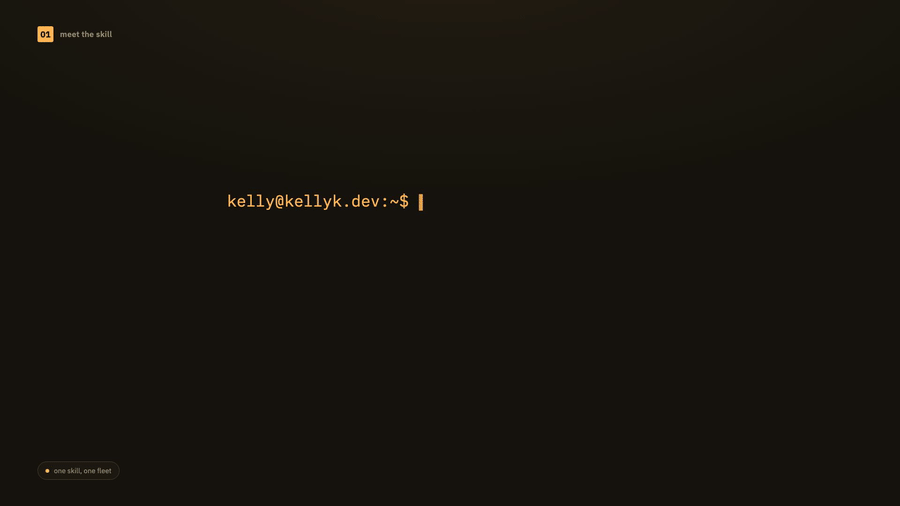

# agents

Skills for running, delegating to, and coordinating other agents.

- [cmux-agent-orchestrator](#cmux-agent-orchestrator)
- [cmux-pr-qc-agent](#cmux-pr-qc-agent)

---

## cmux-agent-orchestrator

Run a hierarchy of Claude Code orchestrators across cmux workspaces.



*(silent GIF for inline preview — [full video with audio](../../media/cmux-agent-orchestrator-explainer.mp4))*

**Install:**

```bash
npx skills add kellykampen/agent-skills --skill cmux-agent-orchestrator
```

Try without installing:

```bash
npx skills use kellykampen/agent-skills --skill cmux-agent-orchestrator --agent claude-code
```

**What it does**

A single **lead orchestrator** that drives several per-project **sub-orchestrators** over the cmux control plane — reading their state, relaying your decisions down, and keeping the whole fleet aligned to one set of standing directives.

**Why it exists**

Once you're running more than one or two agents on more than one project, keeping track of what each one is doing — and making sure they're all following the same quality bar — stops being something you can hold in your head. This skill turns that into a repeatable loop instead of ad hoc babysitting.

**How it works**

The lead orchestrator discovers live sub-orchestrators via the cmux control plane (no hardcoded project list), runs a continuous-digest or overnight-autonomous watch loop, resets a sub-orchestrator's context when it gets low, spins up new cmux agents, onboards a new project into the fleet, rebuilds everything after a crash, and enforces evidence-based QC across the board.

**Requirements**

Requires `cmux` on `PATH`.

Source: [`cmux-agent-orchestrator/SKILL.md`](./cmux-agent-orchestrator/SKILL.md)

---

## cmux-pr-qc-agent

An autonomous agent that shepherds a GitHub PR to mergeable, end to end.

**Install:**

```bash
npx skills add kellykampen/agent-skills --skill cmux-pr-qc-agent
```

Try without installing:

```bash
npx skills use kellykampen/agent-skills --skill cmux-pr-qc-agent --agent claude-code
```

**What it does**

Spins up an independent, autonomous Claude Code instance in a separate cmux pane that owns a single GitHub PR until it's done — CI green, every review comment answered.

**Why it exists**

Watching CI, re-running failed checks, and replying to review comments one by one is exactly the kind of loop that's better delegated than done by hand — especially once you've moved on to the next piece of work.

**How it works**

Polls for new review comments and CI status, drives every check to green by *fixing* failures with tests (not just re-running them), addresses each review comment with a failing-test-first change, and replies to each comment individually with the fixing commit — looping until the PR is green and every thread is answered.

**Requirements**

Requires `cmux`, `gh`, `git` on `PATH`.

Source: [`cmux-pr-qc-agent/SKILL.md`](./cmux-pr-qc-agent/SKILL.md)

---
[← Back to all skills](../../README.md)
