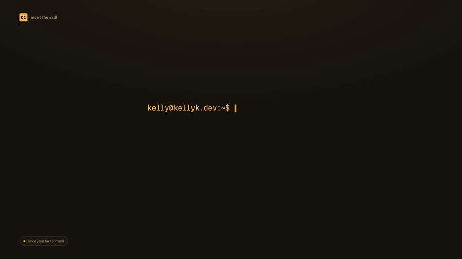
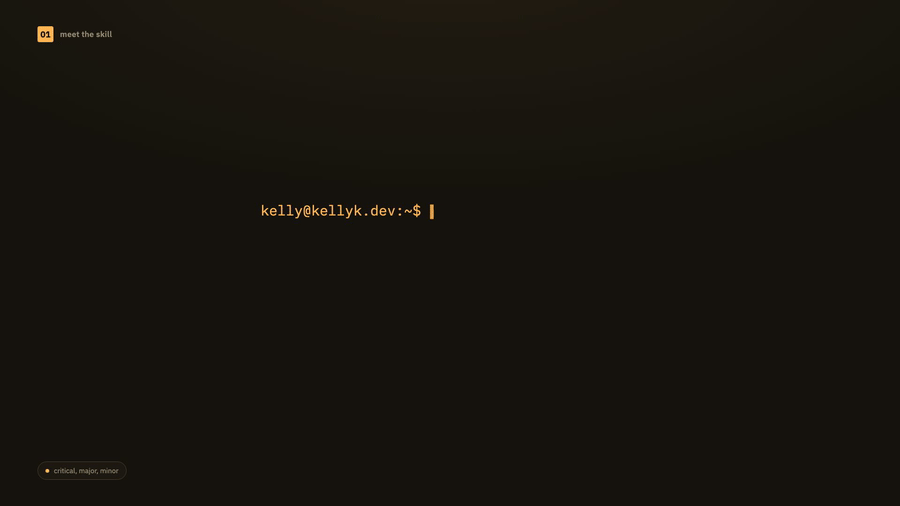
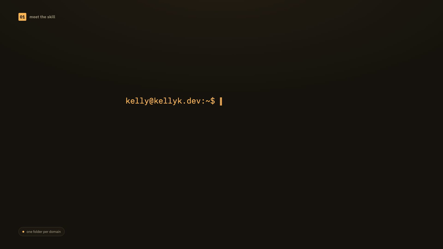
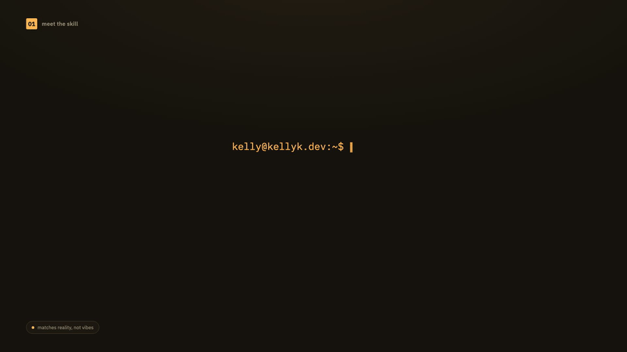

# engineering

Skills for day-to-day code and backend work.

- [add-to-changelog](#add-to-changelog)
- [coderabbit-request](#coderabbit-request)
- [convex-domain-folder](#convex-domain-folder)
- [e2e-remote-setup](#e2e-remote-setup)
- [update-docs](#update-docs)

---

## add-to-changelog

Add a properly-formatted entry to CHANGELOG.md — Keep a Changelog + SemVer.



*(silent GIF for inline preview — [full video with audio](../../media/add-to-changelog-explainer.mp4))*

**Install:**

```bash
npx skills add kellykampen/agent-skills --skill add-to-changelog
```

Try without installing:

```bash
npx skills use kellykampen/agent-skills --skill add-to-changelog --agent claude-code
```

**What it does**

A one-shot command: give it a version, a change type, and a message, and it adds a correctly-formatted entry to your project's `CHANGELOG.md`, creating the file if it doesn't exist yet.

**Why it exists**

Changelogs rot the same way docs do — usually because updating one by hand means remembering the exact heading format, section order, and where today's version block goes. This skill removes the friction so there's no excuse to skip it.

**How it works**

Parses `<version> <change_type> <message>`, finds or creates the right `## [version] - date` section, and slots the entry under the matching `### Added/Changed/Fixed/...` heading — keeping versions in reverse-chronological order.

**Requirements**

Requires `git` on `PATH`.

Source: [`add-to-changelog/SKILL.md`](./add-to-changelog/SKILL.md)

---

## coderabbit-request

Dispatch a CodeRabbit review of your uncommitted changes and get back a structured issue list.



*(silent GIF for inline preview — [full video with audio](../../media/coderabbit-request-explainer.mp4))*

**Install:**

```bash
npx skills add kellykampen/agent-skills --skill coderabbit-request
```

Try without installing:

```bash
npx skills use kellykampen/agent-skills --skill coderabbit-request --agent claude-code
```

**What it does**

The first step of a change → review → triage → fix loop: run CodeRabbit against your uncommitted diff and return a clean, severity-categorized list of what it found.

**Why it exists**

"It's just docs" or "it's a small change" is exactly when review gets skipped — and exactly when a lightweight pass still catches something. Making review a one-command habit closes that gap.

**How it works**

Stages your changes, runs the `coderabbit` CLI in the background via `gob` (reviews take 1-3 minutes), and parses the output into `critical` / `important` / `minor` buckets with file, line, issue, and suggestion for each — CodeRabbit's exact wording preserved, nothing invented or filtered.

**Requirements**

Requires `gob`, `coderabbit`, `git` on `PATH`.

Source: [`coderabbit-request/SKILL.md`](./coderabbit-request/SKILL.md)

---

## convex-domain-folder

Reorganize a Convex backend into per-domain folders without breaking anything.



*(silent GIF for inline preview — [full video with audio](../../media/convex-domain-folder-explainer.mp4))*

**Install:**

```bash
npx skills add kellykampen/agent-skills --skill convex-domain-folder
```

Try without installing:

```bash
npx skills use kellykampen/agent-skills --skill convex-domain-folder --agent claude-code
```

**What it does**

Moves a flat `convex/<name>.ts` into a `convex/<name>/` directory where each domain owns its own `schema.ts` (exporting `<domain>Tables`, spread into the root schema) plus optional `queries.ts` / `mutations.ts` / `model.ts`.

**Why it exists**

A growing Convex backend tends to accumulate one giant schema/functions file. The move to per-domain folders looks trivial — it isn't. The `api.<domain>.*` function paths and the `convex-test` glob resolution for co-located tests are easy to get wrong by hand.

**How it works**

Splits table definitions out of the monolithic schema, repoints every relative import, updates the generated `api.<domain>.queries.*` / `api.<domain>.mutations.*` call sites, and re-roots the `convex-test` glob so co-located tests keep resolving correctly.

**Requirements**

Requires `convex` on `PATH`.

Source: [`convex-domain-folder/SKILL.md`](./convex-domain-folder/SKILL.md)

---

## e2e-remote-setup

Run a focus-stealing Electron/GUI E2E suite on a remote headless box instead of your machine.

**Install:**

```bash
npx skills add kellykampen/agent-skills --skill e2e-remote-setup
```

Try without installing:

```bash
npx skills use kellykampen/agent-skills --skill e2e-remote-setup --agent claude-code
```

**What it does**

Wires up `pnpm test:e2e:remote`: crabbox leases an E2B sandbox, rsyncs the working tree, installs deps, and runs the E2E suite under Xvfb (an in-RAM X display) — so a full Electron app "opens" on the remote box and never grabs your local mouse/keyboard. Bundles the three files to adapt into a target repo (`.crabbox.yaml`, `crabbox/Dockerfile.e2e`, `crabbox/run.sh`) plus the one-time E2B template build.

**Why it exists**

Electron E2E (`_electron.launch`) opens a real OS window with no local headless display, so running it locally steals focus for the whole run — and local CI often can't run a GUI suite at all. Offloading to an on-demand remote box makes the suite runnable without hijacking the dev machine.

**How it works**

Copies + adapts a Dockerfile (Node + full Electron/Chromium libs + Xvfb + baked Electron rebuild headers), a `.crabbox.yaml` (E2B provider, sync excludes, an `e2e` job mirroring the repo's CI E2E step), and a credential-loading `run.sh` wrapper; then `e2b template create` builds the image once. Includes the hard-won gotchas: read per-spec results not the suite exit code, the Daytona 60s-exec-cap trap, native-module dual-ABI rebuilds, and keeping `ELECTRON_VERSION` in lockstep with the lockfile.

**Requirements**

Requires the `crabbox` CLI and an E2B account (`e2b` CLI) on `PATH`; the target repo needs a runnable E2E script.

Source: [`e2e-remote-setup/SKILL.md`](./e2e-remote-setup/SKILL.md)

---

## update-docs

Sync README, /docs, and CLAUDE.md/AGENTS.md with what actually changed.



*(silent GIF for inline preview — [full video with audio](../../media/update-docs-explainer.mp4))*

**Install:**

```bash
npx skills add kellykampen/agent-skills --skill update-docs
```

Try without installing:

```bash
npx skills use kellykampen/agent-skills --skill update-docs --agent claude-code
```

**What it does**

Looks at what changed since your last commit and updates the documentation that should reflect it — README, `/docs/`, and CLAUDE.md/AGENTS.md — without you having to remember everywhere docs might now be stale.

**Why it exists**

Documentation drifts from code by default; someone has to notice and go fix it. Running this after a meaningful change makes 'the docs match the code' the default instead of an occasional cleanup pass.

**How it works**

Diffs `HEAD`, checks recent commit messages for context, categorizes the change (feature, fix/refactor, UI, config, schema), reads the existing docs first to match their structure and voice, then makes only the targeted edits that change actually calls for.

**Requirements**

Requires `git` on `PATH`.

Source: [`update-docs/SKILL.md`](./update-docs/SKILL.md)

---
[← Back to all skills](../../README.md)
