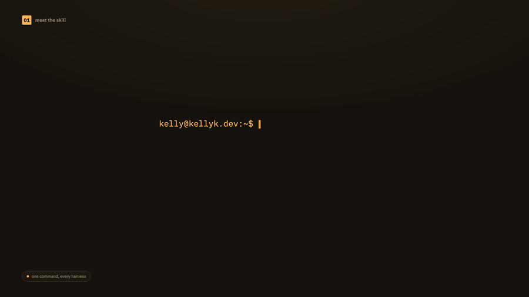
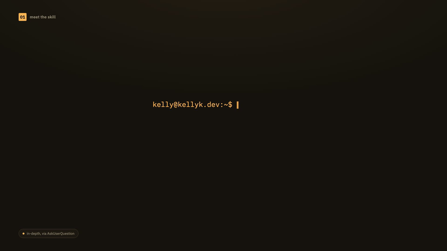
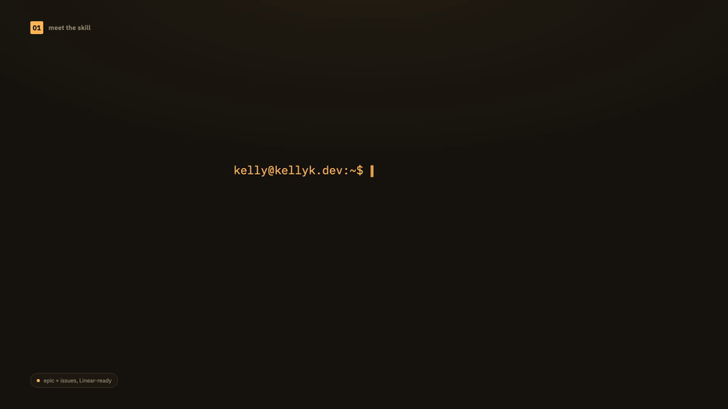
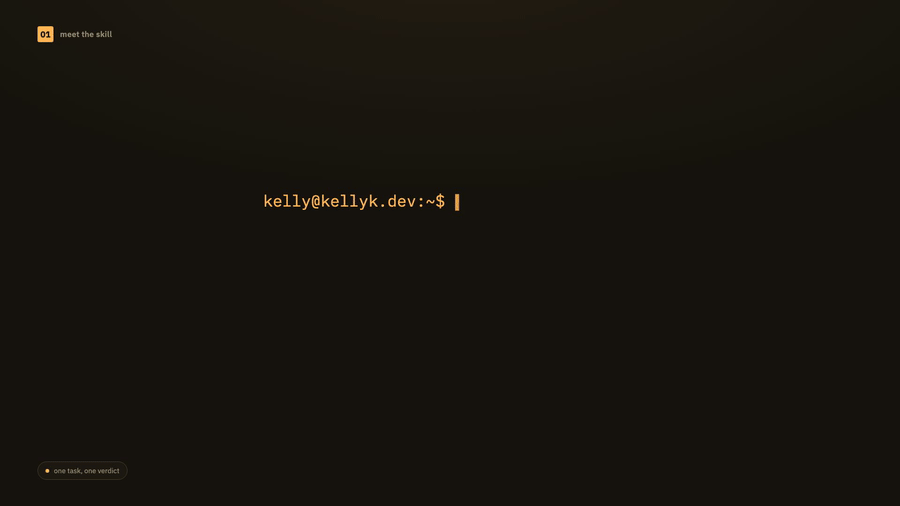
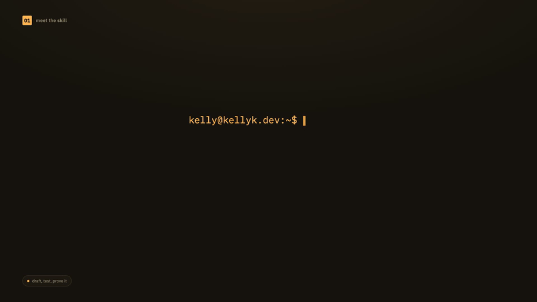
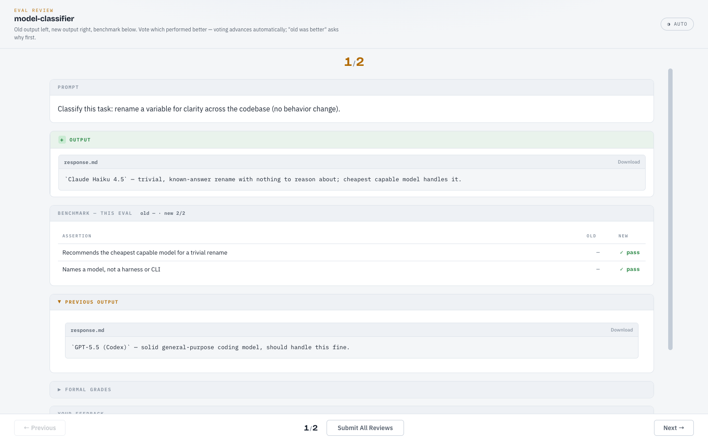

# workflow

Meta-skills about the AI development workflow itself.

- [check-model-usage](#check-model-usage)
- [interview](#interview)
- [issue-breakdown](#issue-breakdown)
- [model-classifier](#model-classifier)
- [remotion-explainer-video](#remotion-explainer-video)
- [skill-maker](#skill-maker)

---

## check-model-usage

One command to check quota and pacing across every AI coding harness you use.



*(silent GIF for inline preview — [full video with audio](../../media/check-model-usage-explainer.mp4))*

**Install:**

```bash
npx skills add kellykampen/agent-skills --skill check-model-usage
```

Try without installing:

```bash
npx skills use kellykampen/agent-skills --skill check-model-usage --agent claude-code
```

**What it does**

A consolidated usage report — current quota plus session (5h) and weekly pacing — across Claude Code, Codex CLI, Antigravity, GLM/Z.ai, and Kimi/Moonshot, in one command.

**Why it exists**

Running out of quota mid-task, or discovering you've been burning a weekly cap too fast to last until reset, is avoidable — but only if you actually check. This makes checking cheap enough to do proactively instead of after the fact.

**How it works**

Wraps the [CodexBar](https://github.com/steipete/CodexBar) CLI — the only data source; no TUI probing, no direct provider API calls, no writes to your codexbar config. Fetches each harness's usage in parallel and computes a pace line (`% in reserve/deficit`, expected vs. actual, time to reset) and a burn-rate line so you know how hard to throttle.

**Requirements**

Requires `codexbar` on `PATH`.

Source: [`check-model-usage/SKILL.md`](./check-model-usage/SKILL.md)

---

## interview

A deep, iterative interview (via AskUserQuestion) that turns an idea into a real spec.



*(silent GIF for inline preview — [full video with audio](../../media/interview-explainer.mp4))*

**Install:**

```bash
npx skills add kellykampen/agent-skills --skill interview
```

Try without installing:

```bash
npx skills use kellykampen/agent-skills --skill interview --agent claude-code
```

**What it does**

Interviews you thoroughly about a plan, feature, or rough idea — technical implementation, UI/UX, edge cases, tradeoffs, the works — then writes the result down one of three ways: back into a plan file, into `plans/<name>.md`, or as a Linear project + issues.

**Why it exists**

The gap between what's in your head and what's actually written down is where most misalignment starts. A single round of clarifying questions rarely closes it; this skill keeps going until it actually does.

**How it works**

Every question goes through AskUserQuestion — never a wall of prose — batched and grounded in the current codebase when there is one. It keeps interviewing round after round, on purpose, until the picture is genuinely complete, then persists it in whichever of the three modes fits what you asked for.

Source: [`interview/SKILL.md`](./interview/SKILL.md)

---

## issue-breakdown

Break a feature into a Linear epic + small, review-ready issues that all clear a strict quality bar.



*(silent GIF for inline preview — [full video with audio](../../media/issue-breakdown-explainer.mp4))*

**Install:**

```bash
npx skills add kellykampen/agent-skills --skill issue-breakdown
```

Try without installing:

```bash
npx skills use kellykampen/agent-skills --skill issue-breakdown --agent claude-code
```

**What it does**

Turns a feature, epic, or rough initiative into **one Linear project (the epic) and a set of small issues** where every issue is a user story ("as a role, I want an action, so a result") with explicit acceptance criteria, a Fibonacci estimate of **3 points or less** (anything larger gets split), a parent epic, blocker/dependency links, and labels. The epic itself is also linked to the **other projects it depends on** (project↔project dependencies). Design issues additionally carry a **screenshot/PNG export** of the target design plus an optional prototype/Figma/Claude Design link.

**Why it exists**

Backlogs decay into vague, oversized tickets — "build the dashboard, 8 points" — that can't be estimated, parallelized, or reviewed. This skill buys *predictability*: the same feature, decomposed by anyone, comes out the same shape. Small stories with real acceptance criteria and a visible dependency graph are what make a backlog you can actually plan and ship against. The ≤3-point rule and the "prefer 1–2 points" bias exist because small tickets review faster, merge sooner, and conflict less.

**How it works**

It's a top-down procedure: frame the **epic** (what/why/how/key-features/non-goals), decompose into **issues** against a fixed quality bar, then wire the **dependencies** in a second pass. It's tool-agnostic — the standard is the same whether you create issues via `linear-cli`, the Linear MCP, or draft specs first — with a `references/linear-cli.md` that maps each rule to the command that enforces it. A completion checklist makes "done" verifiable so no issue ships half-specified.

**Requirements**

None hard — the methodology is tool-agnostic. To create issues directly it pairs with `linear-cli` (or the Linear MCP); see `references/linear-cli.md`.

Source: [`issue-breakdown/SKILL.md`](./issue-breakdown/SKILL.md)

---

## model-classifier

Pick the single best model for a task — scored, not guessed.



*(silent GIF for inline preview — [full video with audio](../../media/model-classifier-explainer.mp4))*

**Install:**

```bash
npx skills add kellykampen/agent-skills --skill model-classifier
```

Try without installing:

```bash
npx skills use kellykampen/agent-skills --skill model-classifier --agent claude-code
```

**What it does**

Classifies any task description into the best underlying AI model to run it on, scored on cost, intelligence, and taste, across a roster of current frontier and budget models.

**Why it exists**

"Which model should do this" is a decision people make from habit, not from a consistent standard — which means the same task gets a different (and sometimes wrong) answer depending on who's asking. This gives it one answer, and lets that answer improve over time.

**How it works**

Returns a **model**, not a harness or CLI — what actually runs it is a separate decision. Consult it before delegating work to a subagent, casting an Agent/Workflow call, or deciding who implements/reviews/designs a piece of work, rather than picking from memory.

Source: [`model-classifier/SKILL.md`](./model-classifier/SKILL.md)

---

## remotion-explainer-video

Turn a skill, feature, or product into a short explainer video — MP4 + GIF, real music, one command.

**Install:**

```bash
npx skills add kellykampen/agent-skills --skill remotion-explainer-video
```

Try without installing:

```bash
npx skills use kellykampen/agent-skills --skill remotion-explainer-video --agent claude-code
```

**What it does**

Produces a ~15-30s [Remotion](https://remotion.dev) explainer video for whatever you want explained, rendered in a tested dark editorial-diagram visual system (numbered chapters, boundary-aware curved arrows, node/worker circles, a running status caption) with a real royalty-free soundtrack sourced live from Pixabay Music — output as both an MP4 and a GIF from one build.

**Why it exists**

Every one of this collection's own explainer videos (including `cmux-agent-orchestrator`'s and `model-classifier`'s) came out of the same hand-built process: scaffold a Remotion project, design a scene sequence, fight Cloudflare for a soundtrack, hit the same handful of Remotion gotchas, render, convert to GIF. This skill is that process, captured once so it doesn't get reinvented and re-debugged from scratch every time.

**How it works**

Detects an existing Remotion project in the working directory (or scaffolds a fresh one), copies in a bundled set of reusable diagram primitives (curved arrows with boundary-aware math, node circles, chapter badges, an ephemeral cast/clear lifecycle pattern for anything that repeats), picks a diagram shape that matches the subject's actual structure, iterates via cheap single-frame stills before committing to a full render, then renders through a versioned script that never overwrites a previous cut and converts to GIF via ffmpeg. Sourcing music from Pixabay requires real browser automation, not `curl` — Pixabay's download endpoint sits behind a Cloudflare bot-check that only a real browser session clears.

**Requirements**

Requires `node` and `ffmpeg` on `PATH`, plus a browser-automation tool (cmux or claude-in-chrome) to source music from Pixabay.

Source: [`remotion-explainer-video/SKILL.md`](./remotion-explainer-video/SKILL.md)

---

## skill-maker

A toolkit for creating, evaluating, and versioning Claude Code skills.



*(silent GIF for inline preview — [full video with audio](../../media/skill-maker-explainer.mp4))*

**Install:**

```bash
npx skills add kellykampen/agent-skills --skill skill-maker
```

Try without installing:

```bash
npx skills use kellykampen/agent-skills --skill skill-maker --agent claude-code
```

**What it does**

Everything needed to author a skill end to end: scaffold it, edit or improve an existing one, run evals, benchmark performance against a baseline, and tighten a skill's description so it actually triggers when it should.

**Why it exists**

A skill is only as good as its description (does it trigger when it should?) and only as trustworthy as its versioning (did the number move when the behavior did?). This is the toolkit that enforces both, instead of leaving them to memory.

**How it works**

`init_skill.py` scaffolds a spec-valid `SKILL.md` (semver `x.y.z` from the first commit); `quick_validate.py` hard-fails anything that isn't properly versioned, missing an author, or carrying a malformed `requires`; the eval viewer shows old-vs-new output side by side with arrow-key voting, plus per-eval benchmarks inline.



**Requirements**

Requires `python3` on `PATH`.

Source: [`skill-maker/SKILL.md`](./skill-maker/SKILL.md)

---

[← Back to all skills](../../README.md)
